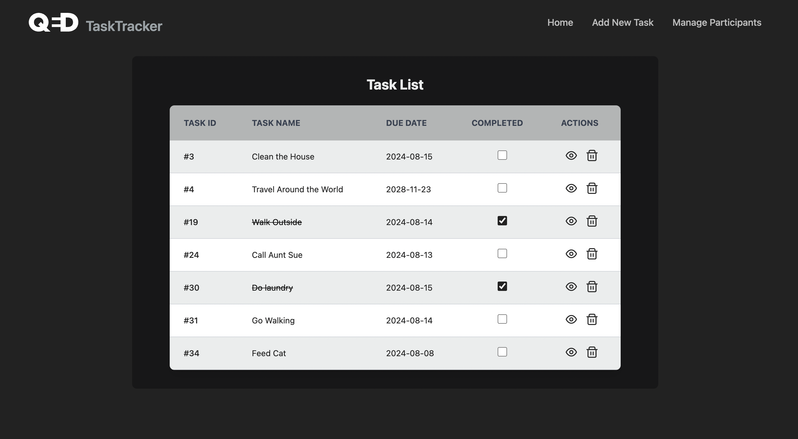

# Task Tracker - Full Stack Application

## Overview

This project is a full-stack application that includes a Vue.js frontend and a Django REST Framework (DRF) backend. The application is designed to manage tasks and participants, allowing users to view, create, edit, and delete tasks and participants. The frontend uses Vue.js along with Tailwind CSS for styling and PrimeIcons for UI icons, while the backend provides a RESTful API to handle data persistence.


## Screenshot

Here’s a screenshot of the main page:



## Features

### Frontend (Vue.js)
- **Task Management**: View, create, edit, and delete tasks.
- **Participant Management**: Manage participants, including inline editing and deletion.
- **API Integration**: Connects to the Django REST API to fetch, update, and manage tasks and participants.
- **Styling**: Uses Tailwind CSS for a responsive and clean user interface.
- **State Management**: Pinia is used for state management.
- **Icons**: PrimeIcons are used for UI elements.

### Backend (Django REST Framework)
- **Task Model**: Manages tasks with fields for name, due date, completion status, and associated participants.
- **Participant Model**: Manages participants with fields for first name, last name, and email.
- **API Endpoints**: Provides CRUD operations for tasks and participants.

## Project Structure

```
my-project/
├── backend/
│   ├── api/
│   │   ├── __init__.py
│   │   ├── admin.py
│   │   ├── apps.py
│   │   ├── models.py
│   │   ├── serializers.py
│   │   ├── tests.py
│   │   ├── urls.py
│   │   └── views.py
│   ├── taskapi/
│   │   ├── __init__.py
│   │   ├── asgi.py
│   │   ├── settings.py
│   │   ├── urls.py
│   │   └── wsgi.py
│   ├── manage.py
│   ├── db.sqlite3
│   └── requirements.txt
├── frontend/
│   ├── node_modules/
│   ├── public/
│   │   ├── favicon.ico
│   │   └── index.html
│   ├── src/
│   │   ├── assets/
│   │   │   └── main.css
│   │   ├── components/
│   │   │   ├── AddTask.vue
│   │   │   ├── EditParticipant.vue
│   │   │   ├── EditTask.vue
│   │   │   ├── NavBar.vue
│   │   │   ├── ParticipantList.vue
│   │   │   ├── TaskDetail.vue
│   │   │   ├── TaskItem.vue
│   │   │   ├── TaskList.vue
│   │   ├── stores/
│   │   │   └── taskStore.js
│   │   ├── views/
│   │   │   ├── HomeView.vue
│   │   │   └── AboutView.vue
│   │   ├── api.js
│   │   ├── App.vue
│   │   ├── main.js
│   │   └── router.js
│   ├── .gitignore
│   ├── index.html
│   ├── jsconfig.json
│   ├── package-lock.js
│   ├── package.json
│   ├── postcss.config.cjs
│   ├── tailwind.config.cjs
│   ├── tailwind.config.cjs
│   └── vite.config.js
├── .gitignore
├── README.md
├── package-lock.json
├── package.json
└── docker-compose.yml
```

## Setup Instructions


### Backend Setup

1. **Clone the repository**:
   ```bash
   git clone https://github.com/han-11/APIIntegration.git
   cd backend
   ```

2. **Create a virtual environment**:
   ```bash
   python3 -m venv venv
   source venv/bin/activate
   ```

3. **Install dependencies**:

   To install the backend dependencies, use the `requirements.txt` file provided in the `backend` directory:

   ```bash
   pip install -r requirements.txt
   ```

4. **Apply database migrations**:
   ```bash
   python manage.py migrate
   ```

5. **Run the development server**:
   ```bash
   python manage.py runserver
   ```

### Frontend Setup

1. **Navigate to the frontend directory**:
   ```bash
   cd ../frontend
   ```

2. **Install dependencies**:
   ```bash
   npm install
   ```

3. **Run the Vue.js development server**:
   ```bash
   npm run serve
   ```

### Running the FullStack Application

To run both the frontend and backend together, navigate to the main project folder and run:

```bash
npm run dev
```

This command is set up to start both the Django development server and the Vue.js development server concurrently, enabling full-stack development.

- **Backend**: The Django REST API will be available at `http://127.0.0.1:8000/`.
- **Frontend**: The Vue.js application will be available at `http://localhost:8080/`.

### API Endpoints

- **Tasks**:
  - `GET /tasks/`: List all tasks.
  - `POST /tasks/`: Create a new task.
  - `GET /tasks/:id/`: Retrieve a single task by ID.
  - `PUT /tasks/:id/`: Update a task by ID.
  - `DELETE /tasks/:id/`: Delete a task by ID.

- **Participants**:
  - `GET /participants/`: List all participants.
  - `POST /participants/`: Create a new participant.
  - `GET /participants/:id/`: Retrieve a single participant by ID.
  - `PUT /participants/:id/`: Update a participant by ID.
  - `DELETE /participants/:id/`: Delete a participant by ID.

### Additional Notes

- **Error Handling**: The frontend handles API errors gracefully, displaying appropriate messages to users when requests fail.
- **Responsive Design**: The UI is fully responsive, leveraging Tailwind CSS for a consistent experience across devices.
- **State Management**: The application uses Pinia for managing the state of tasks and participants.

### Future Enhancements

- **Pagination**: Implementing pagination for large lists of tasks and participants.
- **Testing**: Adding unit and integration tests for both the frontend and backend.

